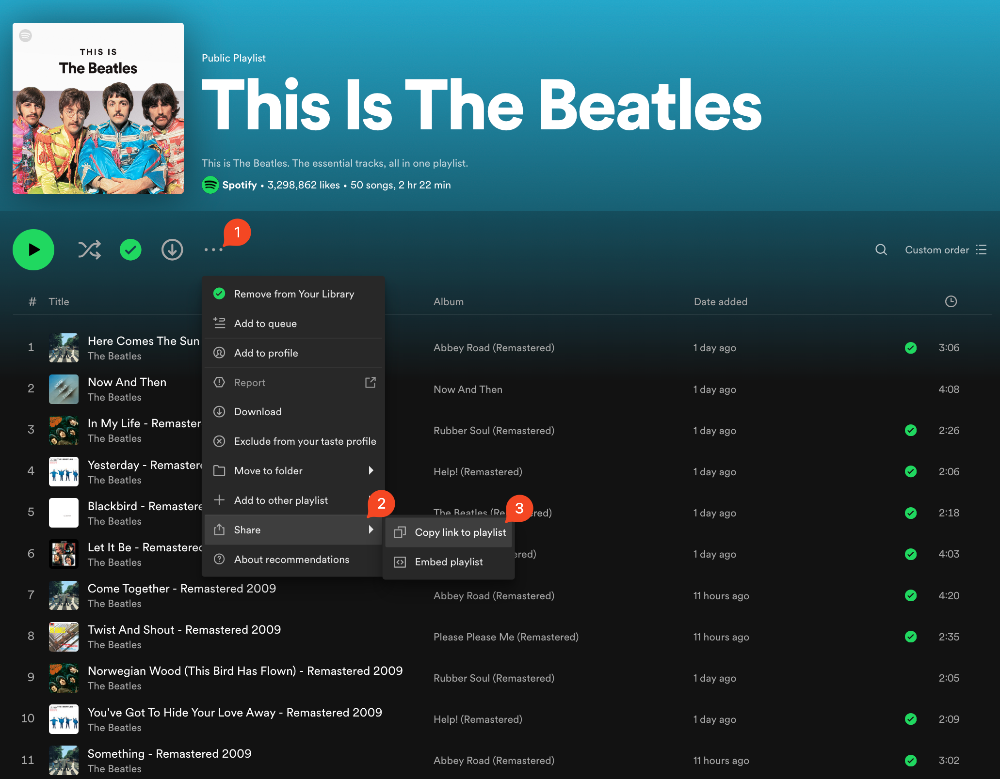

# MusicDownload

Script to download music from Spotify

## About The Project

This script downloads music from Spotify. Due to legal reasons, this script is intended for personal use only, and no monetization will be pursued.

<!-- GETTING STARTED -->
## Getting Started

### Prerequisites
- [python3](https://www.python.org/downloads/) 

### Installation

1. Clone the repo
   ```sh
   git clone https://github.com/fontainecoutino/MusicDownload.git
   cd MusicDownload
   ```

2. Install dependencies
   ```sh
   make setup
   ```

<!-- USAGE EXAMPLES -->
## Usage


### Mac
#### 1. Add spotify urls to file
To run the script, first, ensure you add the Spotify links in the `urls.txt` file. One link per line. 

<p float="left">
    
    
</p>

#### 2. Run
* Default download
    ```sh
    make run
    ```
    By default, the script downloads the music in .mp3 format.

* Custom download with output path
    ```sh
    make run FORMAT={mp3,flac,ogg,opus,m4a,wav} OUT="filepath"
    ```
#### Example `urls.txt`
Here you can add individual tracks, albums, playlists, or artists.
```txt
https://open.spotify.com/track/3BQHpFgAp4l80e1XslIjNI?si=1694ec4cd9b64747
https://open.spotify.com/album/3KzAvEXcqJKBF97HrXwlgf?si=kBwTQYtUQzG4GJO-X5dyqQ
https://open.spotify.com/playlist/37i9dQZF1DZ06evO2iBPiw?si=55d0fbfe69a54668
https://open.spotify.com/artist/3WrFJ7ztbogyGnTHbHJFl2?si=xtuxzf2bQUet4KsMI7Ldwg
```

<!-- USAGE EXAMPLES -->
## Troubleshooting
If you encounter any errors, check the `errors.log` file to view the tracks that could not be downloaded. 

You can always copy the links and paste into the `urls.txt` file to attempt again.
